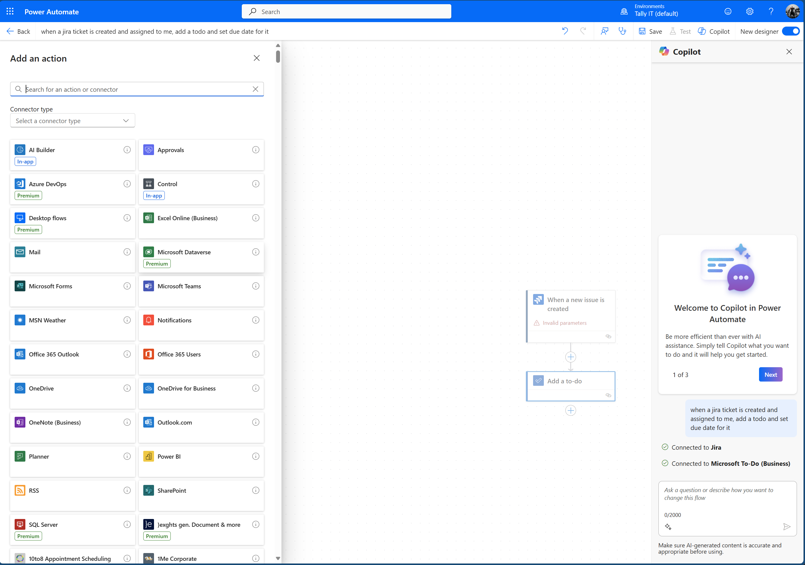

# Introduction to Workflow Automation
quang@spiderbox.design

---
layout: two-cols
---

# What is Workflow Automation?

<v-click>
Workflow is a series of activities needed to complete a task. Workflow automation shifts the performance of those activities from humans to a software program.
</v-click>

::right::

<v-clicks>

- 🤖 Automates repetitive tasks: Reduces manual effort.
- ⚡ Streamlines processes: Improves efficiency and speed.
- 🎯 Reduces errors: Minimizes human mistakes.
- 🔗 Integrates systems: Connects different applications.
- ⏱️ Improves collaboration: Facilitates smoother teamwork.

</v-clicks>

---
layout: default
---

# Real-World Examples

<v-clicks>

- 📊 Automatically generate and send invoices at the end of the month
- 📧 Send daily / weekly / monthly email update, birthday reminder or salary notice
- 📱 Post company updates across multiple social media platforms simultaneously
- 📅 Schedule and send meeting reminders with relevant documents attached
- 📈 Generate weekly performance reports from various data sources
- 🔔 Send notifications when project milestones are reached
- 📝 Recruitment and Onboarding process

</v-clicks>

---
layout: section
---

# Introducing Power Automate
Microsoft's Solution for Workflow Automation

---
layout: two-cols
---

# Power Automate Features

<v-clicks>

- 🔄 500+ pre-built connectors
- 📱 Mobile and desktop apps
- 🤖 AI-powered automation
- 🔒 Enterprise-grade security
- 💻 Low-code/no-code platform

</v-clicks>

::right::

# Key Benefits

<v-clicks>

- 🚀 Quick implementation
- 💡 Easy to learn
- 🔄 Microsoft 365 integration
- 📊 Rich analytics
- 🛠️ Customizable solutions

</v-clicks>
 
---
layout: two-cols
---

# Power Automate Cloud

<v-clicks>

- Web based applications with tons of pre-built connectors.
- Multiple trigger types: time-based, event-based, data-based, etc.
- Copilot available.

</v-clicks>

::right::

---
layout: two-cols
---

# Power Automate Desktop

<v-clicks>

- Desktop application with limited pre-built connectors.
- UI automation available.
- File system access available.

</v-clicks>

::right::

---
layout: image-right
image: ./images/action.png
---

# Actions

<v-clicks>

- Actions are the building blocks of a workflow. Each action is a step in the workflow.
- Action can have inputs and outputs.
- D-click or drag-and-drop to add an action.
- **Think of a function call in your code.**

</v-clicks>

---
layout: image
image: ./images/pad-demo-crawl-shopee.png
---

---
layout: image
image: ./images/pad-demo.gif
---

---
layout: two-cols
---

# Alternatives

<v-clicks>

- Zapier https://zapier.com/
  - 3000+ pre-built connectors
  - More expensive
- Make http://make.com/
  - 1000+ pre-built connectors
  - Easy to use
  - Free tier available
- n8n https://n8n.io/
  - 200+ pre-built connectors
  - More complex but also more flexible
  - Self-hosted option available

</v-clicks>

---
layout: end
---

# Thank you!

quang@spiderbox.design
